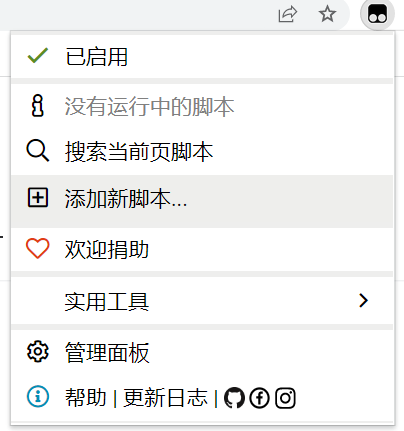
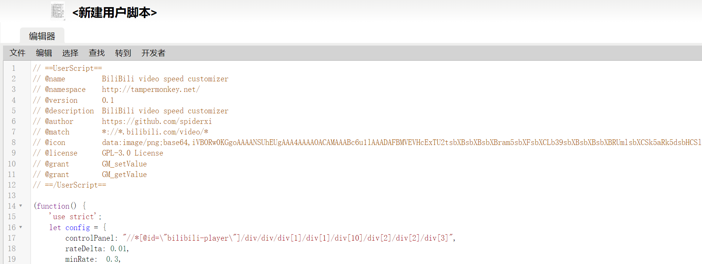

# BiliBili video speed customizer

这是一个TamperMonkey脚本, 可以自定义B站视频倍速.

## 安装和使用

1. 在TamperMonkey菜单中点击添加新脚本

   
2. 复制代码到编辑区, 快捷键Ctrl+S保存

   
3. 打开B站视频, 鼠标移动到视频右下角菜单的倍速按钮上

   
4. 鼠标滚轮滑动可以改变倍速, 鼠标点击按钮可以重置倍速

## 配置

```js
    let config = {
        controlPanel: "//*[@id=\"bilibili-player\"]/div/div/div[1]/div[1]/div[10]/div[2]/div[2]/div[3]",
        rateDelta: 0.01,//一次滚动视频速度变量量
        minRate:  0.3,//最小速度
        maxRate: 5,//最大速度
        speedKey: "BVSC:speed",
        defaultSpeed: 1.0//默认速度
    }
```
